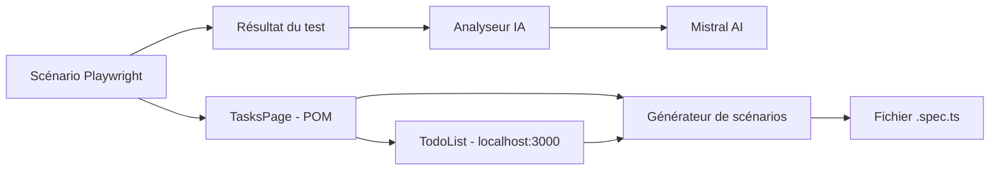

# Playwright + IA : automatisation de tests web

> **Récapitulatif du projet**
>
> Mise en place d'un framework de tests end-to-end avec Playwright, le pattern
> Page Object Model et Mistral AI pour analyser les erreurs et générer des scénarios.

## Sommaire

- [1. Architecture globale](#1-architecture-globale)
- [2. Premier test Playwright](#2-premier-test-playwright)
- [3. Analyse des erreurs par l'IA](#3-analyse-des-erreurs-par-lia)
- [4. Génération de scénarios par l'IA](#4-génération-de-scénarios-par-lia)
- [5. Problèmes rencontrés et solutions](#5-problèmes-rencontrés-et-solutions)
- [6. Structure finale du projet](#6-structure-finale-du-projet)

## 1. Architecture globale

L'objectif est de concevoir un framework de tests **end-to-end** moderne avec
Playwright, enrichi par des fonctionnalités d'intelligence artificielle via le
SDK OpenAI connecté à l'API Mistral AI.

### Stack technique

| Élément | Choix |
| --- | --- |
| Langage | TypeScript avec `tsx` |
| Framework E2E | Playwright |
| Architecture de test | Page Object Model (POM) |
| Couche IA | SDK OpenAI avec l'API Mistral |
| Modèle LLM | `mistral-small-latest` |

### Flux général



## 2. Premier test Playwright

Le pattern **Page Object Model** sépare les interactions avec l'interface de la
logique de test. Les sélecteurs et les actions de la page sont centralisés dans
`TasksPage`.

### 2.1 Création de l'arborescence

```bash
mkdir -p tests/features/tasks/scenarios shared ai results
```

### 2.2 Page Object : `tests/features/tasks/tasks.page.ts`

```typescript
import { Page, Locator, expect } from '@playwright/test';

export class TasksPage {
  readonly page: Page;
  readonly taskInput: Locator;
  readonly addButton: Locator;

  constructor(page: Page) {
    this.page = page;
    this.taskInput = page.getByPlaceholder('Nouvelle tâche...');
    this.addButton = page.getByRole('button', { name: 'Ajouter' });
  }

  async goto() {
    await this.page.goto('http://localhost:3000');
  }

  async addTask(title: string) {
    await this.taskInput.fill(title);
    await this.addButton.click();
  }

  async verifyTaskVisible(title: string) {
    await expect(this.page.getByText(title).first()).toBeVisible();
  }
}
```

### 2.3 Scénario : `create-task.spec.ts`

```typescript
import { test } from '@playwright/test';
import { TasksPage } from '../tasks.page';

test.describe('Gestion des tâches', () => {
  test('Création d’une nouvelle tâche avec succès', async ({ page }) => {
    const tasksPage = new TasksPage(page);

    await tasksPage.goto();
    const taskTitle = 'Première tâche de test Playwright';
    await tasksPage.addTask(taskTitle);
    await tasksPage.verifyTaskVisible(taskTitle);
  });
});
```

## 3. Analyse des erreurs par l'IA

Cette phase envoie les détails d'un test en échec à Mistral AI afin d'obtenir un
diagnostic explicatif et une recommandation de correction.

### 3.1 Installation et configuration

```bash
npm install openai dotenv
npm install --save-dev @types/node tsx
```

Configuration de `tsconfig.json` :

```json
{
  "compilerOptions": {
    "target": "ES2022",
    "module": "CommonJS",
    "moduleResolution": "node",
    "ignoreDeprecations": "6.0",
    "esModuleInterop": true,
    "strict": true,
    "skipLibCheck": true,
    "types": ["node", "@playwright/test"]
  },
  "include": ["tests/**/*.ts", "shared/**/*.ts", "ai/**/*.ts"]
}
```

### 3.2 Client Mistral : `ai/llm/mistral.ts`

```typescript
import OpenAI from 'openai';
import 'dotenv/config';

export const mistralClient = new OpenAI({
  apiKey: process.env.MISTRAL_API_KEY,
  baseURL: 'https://api.mistral.ai/v1',
});
```

La clé API est chargée depuis la variable d'environnement `MISTRAL_API_KEY`.

### 3.3 Service d'analyse : `ai/analyzer.ts`

```typescript
import { mistralClient } from './llm/mistral';

export type TestResultPayload = {
  testName: string;
  status: 'passed' | 'failed';
  errorMessage?: string;
};

export async function analyzeTestResult(result: TestResultPayload): Promise<string> {
  const prompt = `
Tu es un expert QA et automatisation de tests.
Analyse le résultat de test suivant et fournis un diagnostic concis et utile.

Nom du test : ${result.testName}
Statut : ${result.status}
${result.errorMessage ? `Erreur : ${result.errorMessage}` : 'Aucune erreur signalée.'}

Réponds au format Markdown avec deux sections :
1. Diagnostic
2. Recommandation
  `;

  const response = await mistralClient.chat.completions.create({
    model: 'mistral-small-latest',
    messages: [{ role: 'user', content: prompt }],
  });

  return response.choices[0]?.message?.content || 'Aucune analyse générée.';
}
```

## 4. Génération de scénarios par l'IA

Pour éviter que le modèle invente des méthodes inexistantes, le générateur reçoit
le code du Page Object et celui du composant React ciblé.

### 4.1 Générateur : `ai/generator.ts`

```typescript
import { mistralClient } from './llm/mistral';

export type GenerateTestPrompt = {
  featureName: string;
  pageObjectPath: string;
  pageObjectCode: string;
  componentCode: string;
};

export async function generateSpecFile(params: GenerateTestPrompt): Promise<string> {
  const prompt = `
Tu es un expert en automatisation de tests Playwright avec TypeScript.
Génère un fichier de test Playwright (.spec.ts) complet et prêt à l'emploi.

Voici le code du PageObject que tu DOIS impérativement utiliser :
\`\`\`typescript
${params.pageObjectCode}
\`\`\`

Voici le code source du composant visé :
\`\`\`tsx
${params.componentCode}
\`\`\`

Règles STRICTES :
1. Utilise uniquement les méthodes et propriétés définies dans le PageObject.
2. N'invente aucune méthode comme \`navigate()\` ou \`fillTaskInput()\`.
3. Importe \`TasksPage\` depuis '${params.pageObjectPath}'.
4. Retourne uniquement le code TypeScript brut, sans balises Markdown.
  `;

  const response = await mistralClient.chat.completions.create({
    model: 'mistral-small-latest',
    messages: [{ role: 'user', content: prompt }],
  });

  return response.choices[0]?.message?.content || '';
}
```

### 4.2 Script de génération : `ai/test-generator.ts`

Le script lit le Page Object, transmet les sources à Mistral AI, nettoie la
réponse puis écrit le scénario dans `tests/features/tasks/scenarios/`.

```bash
npx tsx ai/test-generator.ts
```

## 5. Problèmes rencontrés et solutions

| Problème | Cause | Solution |
| --- | --- | --- |
| `Cannot find name 'process'` | Types Node.js absents | Installer `@types/node` et déclarer `node` dans `tsconfig.json` |
| Incompatibilité de `ts-node` avec Node.js v24 | Problème de lecture de configuration | Utiliser `tsx` pour exécuter TypeScript |
| Méthodes fictives générées par le LLM | Le prompt ne décrivait pas le Page Object | Injecter le code de `TasksPage` et imposer ses méthodes |
| Violation du mode strict Playwright | Plusieurs éléments similaires dans le DOM | Utiliser `.first()` dans l'assertion ciblée |
| Dépréciation de `moduleResolution: node10` | Le mode `node` correspond à `node10` dans TypeScript 6 | Ajouter temporairement `"ignoreDeprecations": "6.0"` |

Correction appliquée pour l'assertion Playwright :

```typescript
await expect(this.page.getByText(title).first()).toBeVisible();
```

## 6. Structure finale du projet

```text
ai-web-testing/
├── .env                              # MISTRAL_API_KEY
├── .gitignore                        # Fichiers ignorés par Git
├── tsconfig.json                     # Configuration TypeScript
├── package.json                      # Dépendances du projet
├── ai/
│   ├── llm/
│   │   └── mistral.ts                # Client OpenAI vers Mistral AI
│   ├── analyzer.ts                   # Diagnostic des échecs de test
│   ├── generator.ts                  # Génération de scripts .spec.ts
│   └── test-generator.ts             # Script d'exécution de la génération
└── tests/
    └── features/
        └── tasks/
            ├── tasks.page.ts         # Page Object de la TodoList
            └── scenarios/
                ├── create-task.spec.ts   # Test manuel validé
                └── created-by-ai.spec.ts # Test généré par l'IA
```

> **Point d'attention** : `MISTRAL_API_KEY` doit rester dans `.env` et ne doit
> jamais être commitée dans le dépôt.